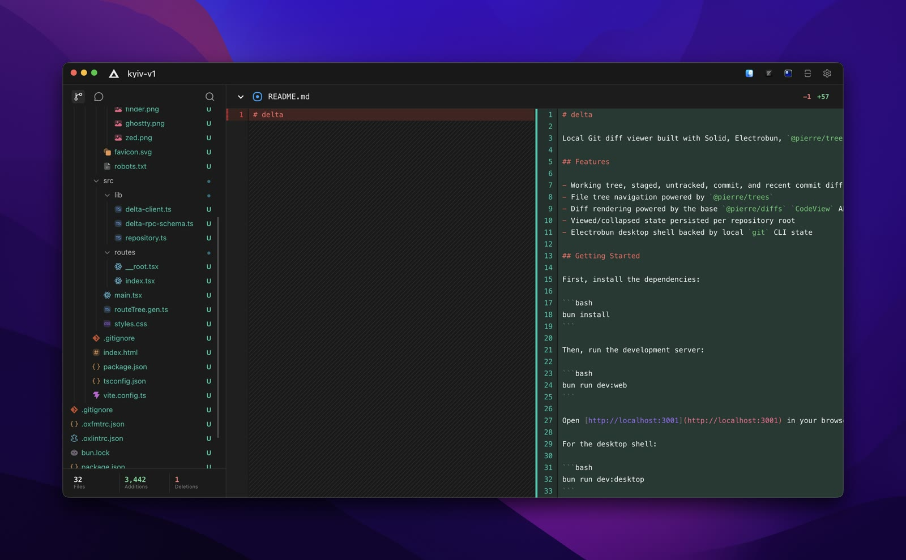

# delta

Local Git diff viewer built with Solid, Electrobun, `@pierre/trees`, and `@pierre/diffs`.



## Features

- Working tree, staged, untracked, commit, and recent commit diff sections
- File tree navigation powered by `@pierre/trees`
- Diff rendering powered by the base `@pierre/diffs` `CodeView` API
- Viewed/collapsed state persisted per repository root
- Electrobun desktop shell backed by local `git` CLI state

## Getting Started

First, install the dependencies:

```bash
bun install
```

Then, run the development server:

```bash
bun run dev:web
```

Open [http://localhost:3001](http://localhost:3001) in your browser to preview the web UI.

For the desktop shell:

```bash
bun run dev:desktop
```

## Git Hooks and Formatting

- Format and lint fix: `bun run check`

## Project Structure

```
delta/
├── apps/
│   ├── desktop/     # Electrobun shell and local git RPC
│   └── web/         # Solid frontend and Pierre diff/tree UI
```

## Available Scripts

- `bun run dev`: Start all applications in development mode
- `bun run build`: Build all applications
- `bun run dev:web`: Start only the web application
- `bun run check-types`: Check TypeScript types across all apps
- `bun run check`: Run Oxlint and Oxfmt
- `bun run dev:desktop`: Start the Electrobun desktop app with HMR
- `bun run build:desktop`: Build the stable Electrobun desktop app
- `bun run build:desktop:canary`: Build the canary Electrobun desktop app
