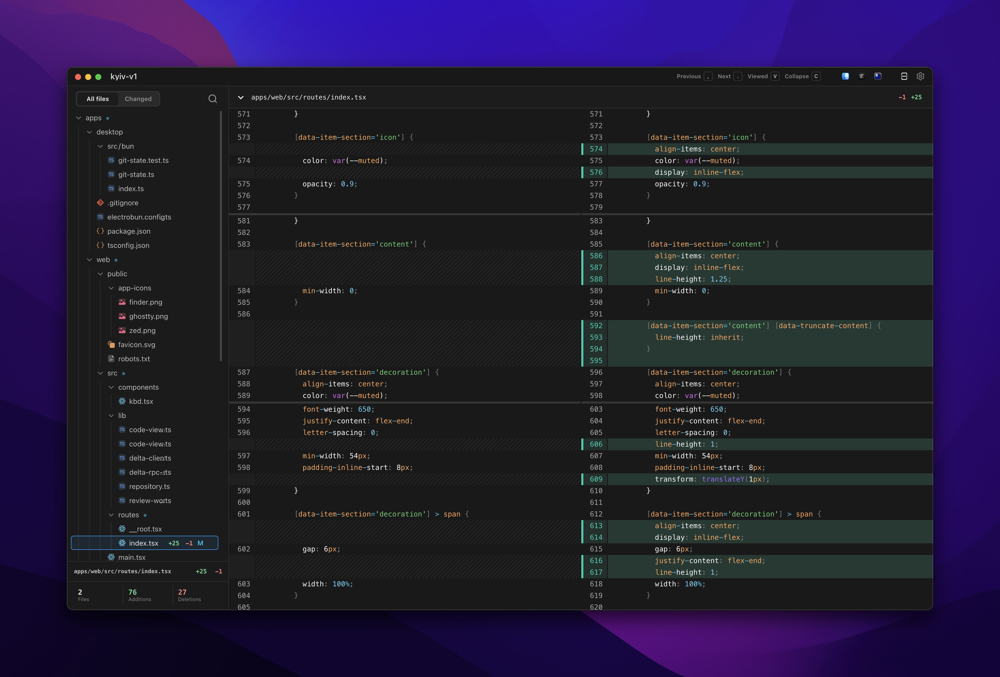

# delta

Local Git diff viewer built with Solid, Electrobun, `@pierre/trees`, and `@pierre/diffs`.



## Features

- Working tree and commit review sources with staged, unstaged, untracked, renamed, deleted, and binary file handling
- Repository file tree with All files and Changed modes, search, file stats, and read-only previews for unchanged files
- Diff rendering powered by the base `@pierre/diffs` `CodeView` API, with smooth file navigation that lands on file headers
- Viewed/collapsed state persisted per repository root
- Keyboard shortcuts for previous/next file navigation, viewed state, collapse, and refresh
- Diff preferences for split/unified view, backgrounds, line numbers, and word wrap
- Electrobun desktop shell backed by local `git` CLI state and safe repository file reads

## Getting Started

First, install the dependencies:

```bash
bun install
```

Then, run the development server:

```bash
bun run dev:web
```

Open [http://localhost:3001](http://localhost:3001) in your browser to preview the web UI with sample repository data.

For the desktop shell:

```bash
bun run dev:desktop
```

The desktop shell reads the current repository through local `git` commands and Electrobun RPC.

## Git Hooks and Formatting

- Format and lint fix: `bun run check`

## Project Structure

```
delta/
├── apps/
│   ├── desktop/     # Electrobun shell and local git RPC
│   └── web/         # Solid frontend and Pierre diff/tree UI
├── docs/
│   ├── adr/         # Architecture decision records
│   └── agents/      # Agent workflow notes
├── CONTEXT.md       # Domain terms and invariants
└── CONTEXT-MAP.md   # Repo routing map
```

## Available Scripts

- `bun run dev`: Start all applications in development mode
- `bun run build`: Build all applications
- `bun run dev:web`: Start only the web application
- `bun run check-types`: Check TypeScript types across all apps
- `bun run check`: Run Oxlint and Oxfmt
- `cd apps/web && bun run test`: Run web unit tests
- `bun test apps/desktop/src/bun/git-state.test.ts`: Run desktop Git state tests
- `bun run dev:desktop`: Start the Electrobun desktop app with HMR
- `bun run build:desktop`: Build the stable Electrobun desktop app
- `bun run build:desktop:canary`: Build the canary Electrobun desktop app
